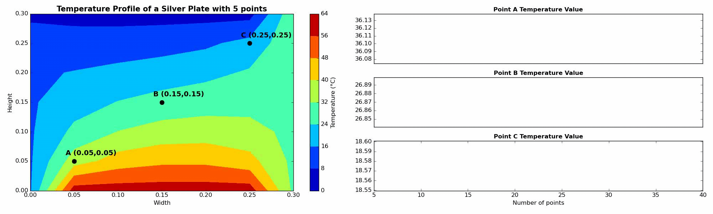

# Chemical Engineering

# [PFR Simulation](https://github.com/EduardoPach/Chemical_Engineering/blob/main/PFR/PFR_Model_and_Simulation.ipynb) 

# [2D Transient Heat Conduction](https://github.com/EduardoPach/Chemical_Engineering/blob/main/2D_Heat_Condutction/Dynamic_2D_Conduction_Simulation.ipynb)

